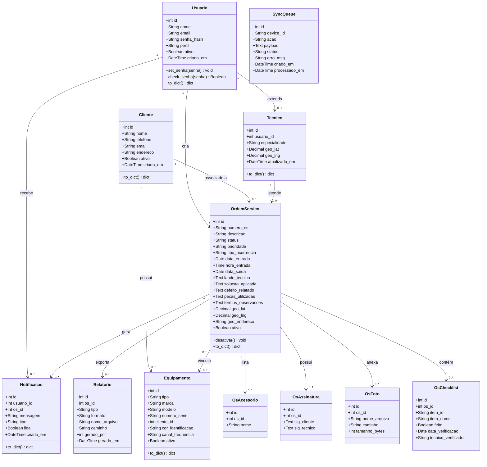
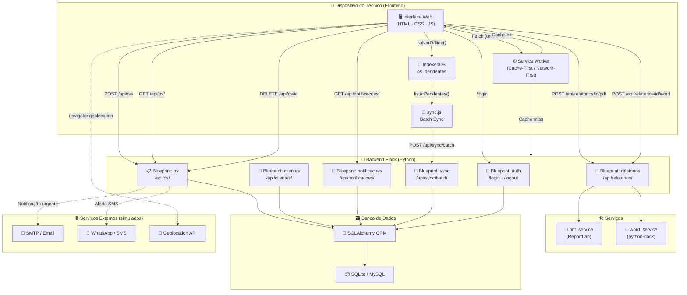

# Arquitetura — Gerenciador de OS para Campo

## Tarefa 1 — Diagrama de Classes UML (Mermaid)



---

## Tarefa 2 — Diagrama de Componentes (Mermaid)



---

## Tarefa 3 — SQL DDL

> Veja o arquivo `schema.sql` na raiz do projeto.  
> Contém todas as tabelas com chaves primárias, estrangeiras,
> índices de performance e **soft delete** (`ativo BOOLEAN DEFAULT 1`)
> garantindo a RN04.

---

## Tarefa 4 — Arquitetura de Sincronização Offline

### Descrição Técnica

O suporte offline é implementado em duas camadas complementares:

**Frontend — Service Worker + IndexedDB**

O `sw.js` intercepta todas as requisições `GET` com estratégia **Cache-First** para
assets estáticos (HTML, CSS, JS) e **Network-First** para rotas de API, armazenando
respostas bem-sucedidas no `CacheStorage` (versão `gerenciador-os-v1`). Quando o
técnico cria uma OS sem conexão, o `app.js` chama `salvarOffline()`, que serializa
todo o payload da OS em JSON e o persiste no IndexedDB (store `os_pendentes`,
keyPath `local_id = "OS-LOCAL-{timestamp}"`). O `sync.js` registra um `BackgroundSync`
com tag `sync-os-pendentes` via `SyncManager` e adiciona listeners para os eventos
`online` e mensagens do Service Worker. Ao detectar reconexão, o `tentarSync()`
lê todos os registros com `status='pendente'` via `osDB.listarPendentes()` e monta
um único **array JSON** com todos eles.

**Backend Flask — Endpoint de batch (`/api/sync/batch`)**

O `sync_bp` recebe o array via `POST /api/sync/batch`, itera sobre cada item e
processa individualmente dentro de um bloco `try/except`, gravando o resultado
(sucesso ou erro) na tabela `sync_queue` para auditoria. A estratégia de **processamento
parcial** com resposta `207 Multi-Status` garante que um item inválido não bloqueie
os demais. Após o processamento, o frontend chama `osDB.marcarSincronizada(localId)`
para cada item bem-sucedido e `osDB.limparSincronizados()` para liberar espaço no
IndexedDB. O resultado final é exibido ao usuário via toast com contagem de
sincronizações bem-sucedidas e erros.

---

## Estrutura de Arquivos

```
PROJETO EXTESAO/
├── app.py                     ← Factory Flask + registro de blueprints
├── config.py                  ← SQLite (dev) / MySQL (prod)
├── models.py                  ← SQLAlchemy models (todos os relacionamentos)
├── schema.sql                 ← DDL completo (MySQL/SQLite)
├── requirements.txt
│
├── blueprints/
│   ├── auth.py                ← Login / logout / registro
│   ├── os_routes.py           ← CRUD de OS + dashboard
│   ├── cliente_routes.py      ← CRUD de clientes + equipamentos
│   ├── notificacao_routes.py  ← Notificações por usuário
│   ├── relatorio_routes.py    ← Export PDF e Word
│   └── sync_routes.py         ← Endpoint de sincronização batch
│
├── services/
│   ├── pdf_service.py         ← ReportLab — PDF estilizado
│   └── word_service.py        ← python-docx — Word estilizado
│
├── templates/
│   ├── base.html              ← Layout Sidebar + Header (Jinja2)
│   ├── login.html             ← Tela de login glassmorphism
│   ├── dashboard.html         ← Dashboard com estatísticas
│   └── os/
│       ├── nova.html          ← Formulário de Nova OS (8 seções)
│       └── lista.html         ← Listagem com filtros e cards
│
└── static/
    ├── css/style.css          ← Design "Nebula Dark" (indigo/violet/cyan)
    ├── manifest.json          ← PWA manifest
    └── js/
        ├── app.js             ← Lógica do formulário + IndexedDB
        ├── lista.js           ← Listagem dinâmica + export
        ├── sig.js             ← Assinaturas digitais canvas
        ├── geo.js             ← Geolocalização GPS
        ├── sw.js              ← Service Worker (offline)
        ├── db.js              ← IndexedDB wrapper
        └── sync.js            ← Sync batch offline→servidor
```
